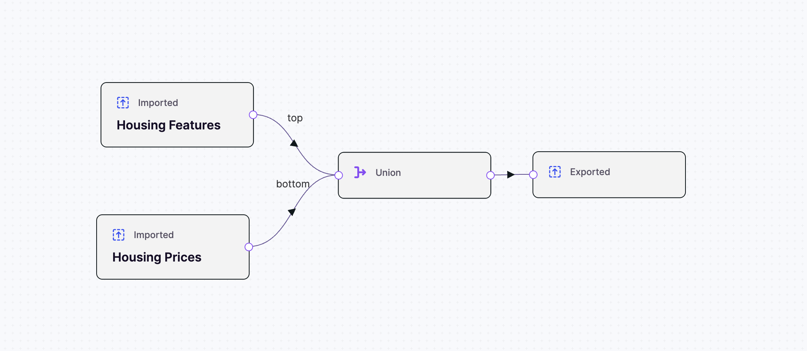

# ikigai

[](https://pypi.org/project/ikigai)
[](https://pypi.org/project/ikigai)
[](https://github.com/ikigailabs-io/ikigai/actions/workflows/checks.yml)

-----

## Table of Contents

- [Ikigai Platform Overview](#ikigai-platform-overview)
- [Getting an API Key](#getting-an-api-key)
- [Requirements](#requirements)
- [Installation](#installation)
- [Creating an Ikigai Client](#creating-an-ikigai-client)
- [Examples](#examples)
- [Apps](#apps)
- [Listing All Apps](#listing-all-apps)
- [Showing Details of an App](#showing-details-of-an-app)
- [Datasets](#datasets)
- [Finding a Dataset from an App](#finding-a-dataset-from-an-app)
- [Showing Details of a Dataset](#showing-details-of-a-dataset)
- [Downloading Your Existing Dataset](#downloading-your-existing-dataset)
- [Creating a New Dataset](#creating-a-new-dataset)
- [Updating a Dataset](#updating-a-dataset)
- [Flows](#flows)
- [Finding a Flow from an App](#finding-a-flow-from-an-app)
- [Running a Flow](#running-a-flow)
- [Getting the Status of a Flow](#getting-the-status-of-a-flow)
- [License](#license)

## Ikigai Platform Overview

The Ikigai Python library provides access to
[Ikigai's Platform API](https://docs.ikigailabs.io/api/platform-api)
for applications written in the Python language.

Ikigai enables you to build artificial intelligence apps, or AI apps,
that support business intelligence, machine learning and operational actions.

Apps are the basic organizational units in Ikigai. Apps are much like folders
and they contain all the components that work together to produce your desired
output. An app includes Connectors, Datasets, Flows, Dashboards, and Models.
You begin by creating an app, and then connecting to data. The data can exist
in a variety of forms, such as records in a database, information in a
spreadsheet or data in an application. To connect to different sources
of data, you use connectors.

Once you can access data, you create flows, which are pipelines to process and
transform the data. In each flow you can add pre-built building-blocks that
perform operations on your data. These building-blocks are called facets.
With flows, you can store rules which restrict who can access data, define
how data should appear in a standardized form and transform data so it’s easier
to analyze. Flows are reusable, which means you or others can define them once
and apply them to other apps.

## Getting an API Key

The library needs to be configured with your account's API key which is
available by logging into the Ikigai platform. To generate your API key
follow the steps below.

1. Once logged in, go to your account, under
**Profile** > **Account**.

1. Select the Keys option.

1. Click **Generate API Key** to generate a unique API key.

1. Click the **Eye icon** to reveal the API key. Save this key in a
secure place and do not share it with anyone else. You will need this
API key to use Ikigai's Python client library in the next sections.

## Requirements

You should have the latest stable version of Python installed in your
environment (~3.12) to use Ikigai's Python client library. Ikigai will
support Python version 3.9 until it's
[EOL (October 31, 2025)](https://endoflife.date/python).

## Installation

Use the [Python Package Index (PyPI)](https://pypi.org/) to install the Ikigai
client library with the following command:

```sh
pip install ikigai
```

### Creating an Ikigai Client

In this section, you create the Ikigai client. The code snippet first imports
the Ikigai library. Then, a new `Ikigai()` object is created. This object
requires your user email and the API key that you generated in the previous
section.

```py
from ikigai import Ikigai

ikigai = Ikigai(user_email="bob@example.com", api_key="my-ikigai-api-key")
```

## Examples

Once you have initiated the Ikigai client, you have access to all Ikigai
components that are exposed by the Python library. The sections below provide
examples for each component and common actions you might perform with each one.

### Apps

Apps are the basic organizational units in Ikigai. Apps contain all the
components that will work together to produce your desired output.

#### Listing All Apps

The code snippet below gets all the apps that are accessible by your account and
stores them in the `apps` variable. Then, it uses a loop to print each app.

```py
apps = ikigai.apps()       # Get all apps accessible by you
for app in apps.values():  # Print each app
    print(app)
```

The output resembles the following example:

```py
Start Here (Tutorial)
Example Project
proj-1234
```

#### Showing Details of an App

The code snippet below gets all the Apps that your account can access and stores
them in the `apps` variable. Then, it gets the app named `my app` and stores it
in the `app` variable. Finally, it prints details about the app, using the
`describe()` method.

```py
apps = ikigai.apps()
app = apps["my app"]       # Get the app named "my app"
print(app.describe())      # Print the details of my app
```

The output resembles the following example:

```py
{
    'app': {
        'app_id': '12345678abcdef',
        'name': 'Start Here (Tutorial)',
        'owner': 'bob@example.com',
        'description': '',
        'created_at': datetime.datetime(
            2024, 12, 13, 20, 0, 52, tzinfo=TzInfo(UTC)
        ),
        'modified_at': datetime.datetime(
            2024, 12, 13, 20, 0, 52, tzinfo=TzInfo(UTC)
        ),
        'last_used_at': datetime.datetime(
            2025, 1, 23, 18, 30, 7, tzinfo=TzInfo(UTC)
        )
    },
    'components': {
        'charts': [
            {
                'chart_id': '88888888fffffff',
                'name': 'Dataset: Sample Chart',
                'project_id': 'abcdefg123456',
                'dataset_id': '4444444bbbbbbb',
                'superset_chart_id': '40929',
                'data_types': {}
            },
            {
                'chart_id': '9999999ggggggg',
                'name': 'Dataset: New Dataset',
                'project_id': 'abcdefg123456',
                'dataset_id': '987654zyxwvu',
                'superset_chart_id': '40932',
                'data_types': {}
            }
        ]
    }
}

...
  'dataset_directories': [{'directory_id': '33333333iiiiiiii',
    'name': '[OUTPUT]',
    'type': 'DATASET',
    'project_id': 'abcdefg123456',
    'parent_id': '',
    'size': '0'},
   {'directory_id': '7777777ggggggg',
    'name': '[INPUT]',
    'type': 'DATASET',
    'project_id': 'abcdefg123456',
    'parent_id': '',
    'size': '0'}],
  'database_directories': [],
  'pipeline_directories': [],
  'model_directories': [],
  'external_resource_directories': []}}
```

### Datasets

Datasets are any data files stored in the Ikigai platform. You can upload your
files to Ikigai to create a dataset. Ikigai supports various file types such as
CSV, and Pandas DataFrame.

#### Finding a Dataset from an App

The code snippet below gets all the apps that your account can access and stores
them in the `apps` variable. Then, it gets the app named `my app` and stores it
in the `app` variable. You can now access all datasets that are associated with
`my-app`. The code stores all the datasets in the `datasets` variable. Next, it
access the dataset named `my-dataset` and stores it in the `dataset` variable
and prints its contents.

```py
apps = ikigai.apps()
app = apps["my app"]              # Get the app named "my app"
datasets = app.datasets()         # Get all datasets in my app
dataset = datasets["my dataset"]  # Get dataset named "my dataset"
print(dataset)
```

The output resembles the following example:

```py
Dataset(
    app_id='12345678abcdef',
    dataset_id='4444444bbbbbbb',
    name='Dataset: New Dataset',
    filename='example.csv',
    file_extension='csv',
    data_types={
        'Channel/Location': ColumnDataType(
            data_type=<DataType.CATEGORICAL: 'CATEGORICAL'>,
            data_formats={}
        ),
        'Product (name/description)': ColumnDataType(
            data_type=<DataType.TEXT: 'TEXT'>,
            data_formats={}
        ),
        'Quantity': ColumnDataType(
            data_type=<DataType.NUMERIC: 'NUMERIC'>,
            data_formats={}
        ),
        'SKU/Unique Item ID': ColumnDataType(
            data_type=<DataType.TEXT: 'TEXT'>,
            data_formats={}
        )
    },
    size=311,
    created_at=datetime.datetime(2024, 1, 1, 20, 0, 55, tzinfo=TzInfo(UTC)),
    modified_at=datetime.datetime(2024, 1, 1, 22, 0, 55, tzinfo=TzInfo(UTC))
)
```

#### Showing Details of a Dataset

The example snippet shows you how to display details related to a dataset.
First, get all datasets stored in a particular app. The example stores all
datasets in the `datasets` variable. Next, store the dataset in a variable. The
example stores the `[INPUT]` dataset in the `dataset` variable. Next, use the
`describe()` method to view a dictionary containing all the dataset's details.

```py
datasets = app.datasets()             # Get all datasets in the app
dataset = datasets["[INPUT]"]         # Get dataset named "[INPUT]"
dataset.describe()
```

The output resembles the following example:

```py
{
    'dataset_id': '4444444bbbbbbb',
    'name': 'Start Here (Tutorial)',
    'project_id': 'abcdefg123456',
    'filename': 'example.csv',
    'data_types': {
        'Channel/Location': {
            'data_type': 'CATEGORICAL',
            'data_formats': {}
        },
        'Product (name/description)': {
            'data_type': 'TEXT',
            'data_formats': {}
        },
        'Quantity': {
            'data_type': 'NUMERIC',
            'data_formats': {}
        },
        'SKU/Unique Item ID': {
            'data_type': 'TEXT',
            'data_formats': {}
        }
    },
    'directory': {
        'directory_id': '33333333iiiiiiii',
        'name': '',
        'type': 'DATASET',
        'project_id': ''
    },
}

```

#### Downloading Your Existing Dataset

The example snippet shows you how to download an existing dataset. First, get
all datasets stored in a particular app. The example stores all datasets in the
`datasets` variable. Next, store the dataset in a variable. The example stores
the `[INPUT]` dataset in the `dataset` variable. Then, download the dataset to
a Pandas DataFrame. You can pass an argument to the `.head()` method to
designate how many rows of the dataset to display (i.e. `df.head(10)`). By
default, the method displays the first 5 rows of the dataset.

```py
datasets = app.datasets()             # Get all datasets in the app
dataset = datasets["[INPUT]"]         # Get dataset named "[INPUT]"
df = dataset.df()                     # Download dataset as a pandas dataframe

df.head()
```

The output resembles the following example:

| Product (name/description) | SKU/Unique Item ID    | Channel/Location | Qty |
|----------------------------|-----------------------|------------------|-----|
| Chocolate Chip Cookie      | Chocolate_C123_Am     | Amazon           | 166 |
| Snickerdoodle Cookie       | Snickerdoodle_C123_Am | Amazon           | 428 |
| Ginger Cookie              | Ginger_C123_Am        | Amazon           | 271 |
| Sugar Cookie               | Sugar_C123_Am         | Amazon           | 421 |
| Double Chocolate Cookie    | Double_C123_Am        | Amazon           | 342 |

#### Creating a New Dataset

The example snippet shows you how to create a new dataset using a Panda's
DataFrame. First, create a new DataFrame object. The example stores the new
DataFrame object in the `df` variable. Next, build a new dataset named
`New Dataset` using the data stored in the `df` variable. Calling the
`new_dataset` variable returns details about the dataset.

```py
df = pd.DataFrame({"Name": ["Alice", "Bob"], "Age": [25, 30]})
# Build a new dataset named "New Dataset" with data df
new_dataset = app.dataset.new("New Dataset").df(df).build()

new_dataset
```

The output resembles the following example:

```py

Dataset(
    app_id='12345678abcdef',
    dataset_id='3232323yyyyyyy',
    name='New Dataset',
    filename='new-example.csv',
    file_extension='csv',
    data_types={
        'Channel/Location': ColumnDataType(
            data_type=<DataType.CATEGORICAL: 'CATEGORICAL'>,
            data_formats={}
        ),
        'Product (name/description)': ColumnDataType(
            data_type=<DataType.TEXT: 'TEXT'>,
            data_formats={}
        ),
        'Quantity': ColumnDataType(
            data_type=<DataType.NUMERIC: 'NUMERIC'>,
            data_formats={'numeric_format': 'INTEGER'}
        ),
        'SKU/Unique Item ID': ColumnDataType(
            data_type=<DataType.TEXT: 'TEXT'>,
            data_formats={}
        )
    },
    size=305,
    created_at=datetime.datetime(2025, 1, 23, 18, 22, 2, tzinfo=TzInfo(UTC)),
    modified_at=datetime.datetime(2025, 1, 23, 18, 22, 9, tzinfo=TzInfo(UTC))
)

```

#### Updating a Dataset

The example snippet shows you how to update an existing dataset. First, get all
datasets stored in a particular app. The example stores all datasets in the
`datasets` variable. Next, store the dataset in a variable. The example stores
the `[INPUT]` dataset in the `dataset` variable. Then, download the dataset as
a Pandas DataFrame. The code stores the DataFrame in the `df` variable. Now, you
can update the DataFrame using the `.columns()` method. The example uses the
`.columns()` method to drop the last column in the DataFrame. It stores the
updated DataFrame in a new variable named `new_dataset`. Finally, update the
dataset with the new data using the `.edit_data()` method. To complete this pass
in the DateFrame `df_updated` as an argument of the `.edit_data()` method.
Display the data in the new dataset using the `.head()` method.

```py
datasets = app.datasets()             # Get all datasets in Start the app
dataset = datasets["[INPUT]"]         # Get dataset named "[INPUT]"
df = dataset.df()                     # Download dataset as a a pandas dataframe
df_updated = df[df.columns[:-1]]      # New dataframe (by dropping last column)
dataset.edit_data(df_updated)         # Update the dataset

dataset.df().head()
```

The output resembles the following example:

| Product (name/description) | SKU/Unique Item ID     | Channel/Location |
|----------------------------|------------------------|------------------|
| Chocolate Chip Cookie      | Chocolate_C123_Am      | Amazon           |
| Snickerdoodle Cookie       | Snickerdoodle_C123_Am  | Amazon           |
| Ginger Cookie              | Ginger_C123_Am         | Amazon           |
| Sugar Cookie               | Sugar_C123_Am          | Amazon           |
| Double Chocolate Cookie    | Double_C123_Am         | Amazon           |

## Models

The Ikigai platform generates insights using patented Large Graphical Models,
like aiMatch for data reconciliation, aiCast for forecasting, and aiPlan for
scenario planning. It also provides commonly used general models, like
Clustering, Decision Trees, Dimensionality Reduction, and several more.

The `ModelType` class generates a [list of all the model types](#model-types)
that are available on the platform. You may want to consult this list before
deciding which model you want to use in a particular flow.

A Model is one of the main components used to generate output that helps you
gather insights from your data. Typically, a model ingests a dataset using an
Input facet and then exports the results using an Output facet. You might also
modify a dataset using a data transformation facet. This sequence of steps is
defined when building a [Flow definition](#building-a-flow-definition).

Each model supports a variety of different parameters that affect the behavior
of the model. Once you know which model your app requires, you can consult the
[help text](#getting-help-with-model-types) connected to that model to learn
which parameters are available and their corresponding default values and
required types. The help text is accessible via the `ModelType` class.

Once you know which model you want to use and the parameters that you need to
define it, you can [build the new model](#creating-a-new-model) on an existing
app object.

Every time that you run a flow that contains a model, a snapshot of the model is
created. You can view all the existing
[versions of a model](#listing-all-versions-of-a-model) by calling the
`versions()` method of the `Model` class. Similarly, the `describe()` method of
the `ModelVersion` class displays
[details related to a specific model version](#showing-details-of-model-version).

Finally, you can list all existing models that are associated with an app and
also, retrieve more details for a specific model contained within an app.

### Listing All Models

When you create a model, it is created on an existing app object. This means
that the model is available to the entire app and can be used in any flow that
is also associated with the app. When building a
[flow definition](#building-a-flow-definition), it may be useful to view a list
of all the models that are associated with an app object.

The Python snippet lists all models associated with the app object, `app`, by
calling the `Model` class' `models()` method. This result is stored in a
variable named `models`. A `for` loop is used to print out all of the app's
associated models.

```py
models = app.models()
for model in models.values():
    print(model)
```

The resulting output resembles the example and contains information,
like the model's name, associated app id, and the model type.

```py
Model(app_id='aB3k9QeL',
      model_id='Z7x4KpQ2',
      name='example_1',
      model_type='Ai Match',
      sub_model_type='Supervised',
      description='',
      created_at='1715274391',
      modified_at='1715274434')

Model(app_id='T5rLm2Nx',
      model_id='gQ81FvBz',
      name='example_2',
      model_type='Time Series',
      sub_model_type='Additive',
      description='',
      created_at='1665850269',
      modified_at='1695397961')

Model(app_id='H3w9UdCy',
      model_id='pKo4vB2W',
      name='example_3',
      model_type='Ai Match',
      sub_model_type='Supervised',
      description='',
      created_at='1697750506',
      modified_at='1732137362')

Model(app_id='N8zGyV5d',
      model_id='La2fKv9M',
      name='example_4',
      model_type='Ai Match',
      sub_model_type='Unsupervised',
      description='',
      created_at='1709310584',
      modified_at='1709310584')
...
```

### Showing Details of a Model

In the [Listing All Models](#listing-all-models) section, the code retrieves a
list of all the models that are associated with a specific app object. Using the
information provided in that list, you can retrieve more details about a
specific model. The `describe()` method of the `Model` class uses a model's
`name` or `description` attribute to retrieve the corresponding model instance
and displays more details.

The example Python code retrieves the model instance using its `description`
argument and stores the model instance in the `model` variable. The model
instance's `describe()` method is called to retrieve more details.

```py
model = app.models()["example_1"]
print(model.describe())
```

The example output displays the model details.

```py
{'created_at': '1715274391',
 'description': 'example 1',
 'directory': {'directory_id': '',
               'name': '',
               'parent_id': '',
               'project_id': '',
               'size': '0',
               'type': 'MODEL'},
 'latest_version_id': '2E3CDzWf',
 'model_id': 'Z7x4KpQ2',
 'model_type': 'Linear',
 'modified_at': '1661814764',
 'name': 'iris_demo',
 'project_id': 'xP7aL2qZ',
 'sub_model_type': 'Base'}
```

### Listing All Versions of a Model

When you last run a flow, a snapshot of a model is created. This preserves all
of the insights generated by the model and the parameters that generated those
insights. See the [Flow Builder](#flowbuilder) and [Flows](#flows) section to
learn more building a flow definition and creating a new flow.

In the example code, the model instance is stored in the object named, `model`.
Its `versions()` method is called and stored in a variable named `versions`.
Then, a `for` loop is used to print every model version and its associated
values.

```py
versions = model.versions()
for version in versions.values():
    print(version)
```

The `for` loop displays all versions of the model instance. Notice that the
output includes the `metrics` keyword that contains all of a model version's
associated insights. In the example's case, there is only one existing version
of the model instance.

```py
ModelVersion(
    app_id='X9b2LpQw',
    model_id='M4Nz8VxY',
    version_id='Rt5HsJ2K',
    version='Demo',
    hyperparameters={
        'C': 1,
        'class_weight': None,
        'dual': False,
        'fit_intercept': True,
        'intercept_scaling': 1,
        'l1_ratio': None,
        'max_iter': 100,
        'multi_class': 'auto',
        'n_jobs': None,
        'penalty': 'l2',
        'random_state': None,
        'solver': 'lbfgs',
        'tol': 0.0001,
        'verbose': 0,
        'warm_start': False
    },
    metrics={
        'feature_importance': {},
        'performance': {
            'accuracy': {
                'average_test': 0.96,
                'average_train': 0.9666666666666667
            }
        }
    },
    created_at='1661814764',
    modified_at='1690303863'
)
```

### Showing Details of Model Version

Once you have identified the version of a model instance whose details you want
to further inspect, you can use the `ModelVersion` class' `describe()` method to
access the instance version's details.

The Python snippet calls all of the versions associated with a model instance
using `model.versions()`. Then, the value of the instance's `version` key is
used to access a specific `ModelVersion` instance. In the example, the value of
the `version` key is `Demo`.

Once retrieved, the `ModelVersion` instance is stored in the `model_version`
variable and its `describe()` method is called to access that version's details.

```py
model_version = model.versions()["Demo"]
print(model_version.describe())
```

When printed, the details returned by the `describe()` method resemble the
example below:

```py
{
    'created_at': '1661814764',
    'hyperparameters': {
        'C': 1,
        'class_weight': None,
        'dual': False,
        'fit_intercept': True,
        'intercept_scaling': 1,
        'l1_ratio': None,
        'max_iter': 100,
        'multi_class': 'auto',
        'n_jobs': None,
        'penalty': 'l2',
        'random_state': None,
        'solver': 'lbfgs',
        'tol': 0.0001,
        'verbose': 0,
        'warm_start': False
    },
    'metrics': {
        'feature_importance': {},
        'performance': {
            'accuracy': {
                'average_test': 0.96,
                'average_train': 0.9666666666666667
            }
        }
    },
    'model_id': 'M4Nz8VxY',
    'modified_at': '1690303863',
    'version': 'Demo',
    'version_id': 'Rt5HsJ2K'
}
```

### Model Types

The Ikigai platform has several patented Large Language Models and general
models that gather insights from a dataset. You can then perform actions on data
based on the patterns recognized by these models. For example, aiMatch is used
for data reconciliation, aiCast is used for forecasting, and aiPlan is used for
scenario planning. When you are mapping out your app's requirements, it may be
useful to view a list of all the model types that are available on the platform.

In the code below, an instance of the Ikigai client is used to access the
`model_types` object. The object is stored in a variable named `model_types`.
The `types` attribute is accessed and returns a list of all the available model
types.

```py
model_types = ikigai.model_types
print(model_types.types)
```

The `model_types`object returns a list of all of Ikigai's model types.

```py
['Ai Cast',
 'Ai Llm',
 'Ai Match',
 'Ai Predict',
 'Anomaly Detection',
 'Change Point Detection',
 'Clustering',
 'Decision Trees',
 'Decomposition',
 'Dimensionality Reduction',
 'Embedding',
 'Estimators',
 'Gaussian Process',
 'Imputation',
 'Linear',
 'Llms',
 'Matrix Completion',
 'Naive Bayes',
 'Nearest Neighbors',
 'Reconciliation',
 'Supply Chain',
 'Svm',
 'Time Series',
 'Vectorizer']
```

#### Getting Help with Model Types

Each model supports a variety of different parameters and hyperparameters that
affect its behavior and performance. These parameters allow you to control a
model’s processing behavior, evaluation metrics, sub-model configuration, and
fine-tuning process. You should consult a model's help text prior to creating a
new model. The help text returns a model's parameters and hyperparameters along
with their corresponding default values and type. The help text is accessible
via the `ModelType` class.

Continuing with the code snippet in the previous [Model Types](#model-types)
section, the variable `model_types` stores an instance of the `ModelTypes`
class. You are now able to use the object instance's `help()` method to access
help text for all models.

```py
# Help on all model types
print(model_types.help())
```

The example output displays the
[aiCast model's](https://docs.ikigailabs.io/guides/aicast) help text.
Ai Cast is used for automatic time series forecasting. Note that the `help()`
method returns the help text for **all** models. The example output is clipped
for brevity.

```py
Ai_Cast = {
    'keywords': ['AI', 'cast', 'time series', 'auto', 'ML', 'AiCast'],
    'sub-model types': {
        'Base': {
            'keywords': ['base'],
            'metrics': {
                'feature_importance': {},
                'performance': {
                    '0': {
                        'name': 'weighted_mean_absolute_percentage_error',
                        'parameters': {
                            '0': {
                                'default_value': 0.5,
                                'have_options': False,
                                'is_deprecated': False,
                                'is_hidden': False,
                                'is_list': False,
                                'name': 'overforecast_weight',
                                'options': [],
                                'parameter_type': 'NUMBER'
                            }
                        },
                        'target_column_data_types': ['NUMERIC', 'TIME']
                    },
                    '1': {
                        'name': 'mean_absolute_percentage_error',
                        'parameters': {
                            '0': {
                                'default_value': 0.5,
                                'have_options': False,
                                'is_deprecated': False,
                                'is_hidden': False,
                                'is_list': False,
                                'name': 'overforecast_weight',
                                'options': [],
                                'parameter_type': 'NUMBER'
                            }
                        },
                        'target_column_data_types': ['NUMERIC', 'TIME']
                    },
                    '2': {
                        'name': 'mean_absolute_error',
                        'parameters': {
                            '0': {
                                'default_value': 0.5,
                                'have_options': False,
                                'is_deprecated': False,
                                'is_hidden': False,
                                'is_list': False,
                                'name': 'overforecast_weight',
                                'options': [],
                                'parameter_type': 'NUMBER'
                            }
                        },
                        'target_column_data_types': ['NUMERIC', 'TIME']
                    },
                    '3': {
                        'name': 'mean_squared_error',
                        'parameters': {
                            '0': {
                                'default_value': 0.5,
                                'have_options': False,
                                'is_deprecated': False,
                                'is_hidden': False,
                                'is_list': False,
                                'name': 'overforecast_weight',
                                'options': [],
                                'parameter_type': 'NUMBER'
                            }
                        },
                        'target_column_data_types': ['NUMERIC', 'TIME']
                    }
                }
            },
            'parameters': {
                'time_column': 'TEXT',
                'identifier_columns': 'list[TEXT]',
                'value_column': 'TEXT',
                'mode':
                    "TEXT = 'train' options=[train|fine_tune|inference|"
                    "retrain_inference]"
            },
            'hyperparameters': {
                'type': "TEXT = 'base' options=[base|hierarchical]",
                'hierarchical_type':
                    "TEXT = 'bottom_up' options=[bottom_up|top_down|"
                    "spatio_temporal_hierarchical|spatio_temporal_grouped|"
                    "spatio_hierarchical|spatio_grouped]",
                'models_to_include':
                    "list[TEXT] = ['Additive', 'Lgmt1', 'Sma', 'Sarimax'] "
                    "options=[Additive|Sma|Deepar|Lgmt1|Last_Interval|"
                    "Lgm-S|Lgbm|Random_Forest|Lasso|Holt_Winters|Croston|"
                    "Sarimax]",
                'eval_method': "TEXT = 'cv' options=[cv|holdout]",
                'time_budget': 'NUMBER = 100',
                'computation_budget': 'NUMBER = 100',
                'enable_parallel_processing': 'BOOLEAN = False',
                'best_model_only': 'BOOLEAN = True',
                'confidence': 'NUMBER = 0.7',
                'fine_tune': "list[MAP] = { filter: list[TEXT] = '' }",
                'api_key': 'TEXT'
            }
        }
    },
    'output_hyperparameters': {
        'output_dimensions': 'NUMBER = 1',
        'embedding_model':
            "TEXT = 'text-embedding-ada-002' "
            "options=[text-embedding-ada-002]"
    }
}
...
```

The previous code snippet retrieved the help text for all of the model types
available on the platform. To retrieve a specific model's help text, access the
model type as an attribute of a `ModelTypes` instance and call its `help()`
method.

The example snippet retrieves the help text for the aiCast model.

```py
# Help for a specific model type
print(model_types.AI_CAST.help())
```

The code returns aiCast's help text including its associated keywords, sub-model
types, settings, parameters, and hyperparameters.

```py
Ai Cast:
    keywords: ['AI', 'cast', 'time series', 'auto', 'ML', 'AiCast']
    sub-model types:
      Base:
        keywords: ['base']
        metrics:
          feature_importance: {}
          performance: {
            '0': {
              'name': 'weighted_mean_absolute_percentage_error',
              'parameters': {
                '0': {
                  'default_value': 0.5,
                  'have_options': False,
                  'is_deprecated': False,
                  'is_hidden': False,
                  'is_list': False,
                  'name': 'overforecast_weight',
                  'options': [],
                  'parameter_type': 'NUMBER'
                }
              },
              'target_column_data_types': ['NUMERIC', 'TIME']
            },
            '1': {
              'name': 'mean_absolute_percentage_error',
              'parameters': {
                '0': {
                  'default_value': 0.5,
                  'have_options': False,
                  'is_deprecated': False,
                  'is_hidden': False,
                  'is_list': False,
                  'name': 'overforecast_weight',
                  'options': [],
                  'parameter_type': 'NUMBER'
                }
              },
              'target_column_data_types': ['NUMERIC', 'TIME']
            },
            '2': {
              'name': 'mean_absolute_error',
              'parameters': {
                '0': {
                  'default_value': 0.5,
                  'have_options': False,
                  'is_deprecated': False,
                  'is_hidden': False,
                  'is_list': False,
                  'name': 'overforecast_weight',
                  'options': [],
                  'parameter_type': 'NUMBER'
                }
              },
              'target_column_data_types': ['NUMERIC', 'TIME']
            },
            '3': {
              'name': 'mean_squared_error',
              'parameters': {
                '0': {
                  'default_value': 0.5,
                  'have_options': False,
                  'is_deprecated': False,
                  'is_hidden': False,
                  'is_list': False,
                  'name': 'overforecast_weight',
                  'options': [],
                  'parameter_type': 'NUMBER'
                }
              },
              'target_column_data_types': ['NUMERIC', 'TIME']
            }
          }
        parameters:
            time_column: TEXT
            identifier_columns: list[TEXT]
            value_column: TEXT
            mode: TEXT = 'train'  options=[
                train|fine_tune|inference|retrain_inference
            ]

        hyperparameters:
            type: TEXT = 'base'  options=[base|hierarchical]
            hierarchical_type: TEXT = 'bottom_up'  options=[
                bottom_up|top_down|spatio_temporal_hierarchical|
                spatio_temporal_grouped|spatio_hierarchical|spatio_grouped
            ]
            models_to_include: list[TEXT] = ['Additive', 'Lgmt1', 'Sma',
                                             'Sarimax']  options=[
                Additive|Sma|Deepar|Lgmt1|Last_Interval|Lgm-S|Lgbm|Random_Forest|
                Lasso|Holt_Winters|Croston|Sarimax
            ]
            eval_method: TEXT = 'cv'  options=[cv|holdout]
            time_budget: NUMBER = 100
            computation_budget: NUMBER = 100
            enable_parallel_processing: BOOLEAN = False
            best_model_only: BOOLEAN = True
            confidence: NUMBER = 0.7
            fine_tune: list[MAP] = {
                filter: list[TEXT] = ''
            }
            include_reals: BOOLEAN = True
            nonnegative: BOOLEAN = False
            interval_to_predict: NUMBER = 10
            metric: TEXT = 'mean_absolute_percentage_error'  options=[
                mean_absolute_percentage_error|mean_absolute_error|
                mean_squared_error|weighted_mean_absolute_percentage_error
            ]
```

Similarly, to the previous section, you may want to retrieve information about
one of the sub-model's that is associated with a specific model. This
information can help you further define the parameter settings for your specific
use case.

This code prints the help text for the `Lasso` sub-model of the `Linear` model
type. It calls the `help()` method from the model_types object.

```py
# Help for a specific sub-model type
print(model_types.Linear.Lasso.help())
```

The code returns the help text associated with the `Lasso` sub-model.

```py
Lasso:
  keywords: ['lasso', 'linear']
  metrics:
    feature_importance:
      {
        '0': {'name': 'shapley'},
        '1': {'name': 'permutation'},
        '2': {'name': 'linear_base'}
      }
    performance:
      {
        '0': {
          'name': 'r2',
          'parameters': {},
          'target_column_data_types': ['NUMERIC', 'TIME']
        },
        '1': {
          'name': 'neg_mean_absolute_error',
          'parameters': {},
          'target_column_data_types': ['NUMERIC', 'TIME']
        },
        '2': {
          'name': 'neg_mean_squared_error',
          'parameters': {},
          'target_column_data_types': ['NUMERIC', 'TIME']
        },
        '3': {
          'name': 'accuracy',
          'parameters': {},
          'target_column_data_types': ['TEXT', 'CATEGORICAL']
        },
        '4': {
          'name': 'balanced_accuracy',
          'parameters': {},
          'target_column_data_types': ['TEXT', 'CATEGORICAL']
        }
      }
  parameters:
    target_column: TEXT
  hyperparameters:
    alpha: NUMBER = 1
```

### Creating a New Model

Once you have reviewed a model's help text, you are ready to create and build
the model. A model is instantiated via an instance of the `App` class.

The example code, creates a new instance of the `ModelBuilder` class by calling
its `new()` method and passing in an attribute for the object's `name`
parameter. Next, using an instance of the `ModelTypes` class, the model type is
set to `Linear.Lasso`. Finally, the ModelBuilder instance's `build()` method is
called to create the model instance. The result of the `.build()` method is
assigned to the variable `model`.

```py
model = (
    app.model.new("Simple Linear Regression with Lasso")
    .model_type(model_type=model_types.Linear.Lasso)
    .build()
)
```

## FlowBuilder

The `FlowBuilder` class enables you to create a flow definition. The flow
definition is where you add and configure the building blocks, or facets, that
transform a dataset. The flow definition also includes any machine learning
models that gather insights from a dataset. Once you have created a flow
definition, you can add it to a [flow](#flows).

### Facet Types

The Ikigai Python Library offers several facets that can import and output a
dataset and transform a dataset in a variety of ways.

Facets that are related to importing a dataset are grouped by the `INPUT`
attribute of an instance of the `FacetType` class. You can import a dataset from
a variety of sources, like an external data source, or a dataset that you
uploaded to the Ikigai platform (see the [Datasets](#datasets) section for more
information).

Facets that are related to transforming a dataset are grouped by the `MID`
attribute of an instance of the `FacetType` class. For example, you may want to
use a facet to join two tables of a dataset, drop missing values, or sample
items from a table.

Facets that are related to exporting a dataset are grouped by the `OUTPUT`
attribute of an instance of the `FacetType` class. Similarly to the input
facets, output facets can export a dataset to the Ikigai platform, an external
dataset, and perform other operations.

Before creating your flow definition, you may want to view a list of all the
facet types that are available in each facet group. The example code shows you
how to do this.

The code gets a new instance of the `FacetTypes` class and stores it in the
variable `facet_types`. Then, the code prints the available facet types for the
three facet type groups, `INPUT`, `MID`, and `OUTPUT`.

```py
facet_types = ikigai.facet_types

print(facet_types.INPUT.types)
print(facet_types.MID.types)
print(facet_types.OUTPUT.types)
```

The code returns three lists containing the name attribute of each facet
available on the Ikigai platform.

```py
['HANA', 'IMPORTED', 'LOAD', 'CUSTOM_FACET', 'INPUT_CONNECTOR', 'PYTHON', 'S3']
['ADD_PRIMARY_KEY',
 'COUNT',
 'CROSS_TAB',
 'DEDUPLICATE',
 'DESCRIBE',
 'DROP_COLUMNS',
 'DROP_MISSING_VALUES',
 'FILL_MISSING_VALUES',
 'FILTER',
 'FIND_REPLACE',
 'FREE_FORM_SQL',
 'INTERPOLATE',
 'KEEP_HEADERS_ONLY',
 'MELT',
 'MULTI_INPUT_FORMULA',
 'NEW_COLUMNS',
 'PIVOT_TABLE',
 'RENAME_COLUMNS',
 'SAMPLE',
 'SELECT',
 'SORT',
 'SUMMARY',
 'TEXT_SPLIT',
 'TRANSPOSE',
 'ADD_CURRENT_TIME',
 'ADD_OR_SUBTRACT_TIME',
 'CHANGE_TIME_GRANULARITY',
 'FILTER_BY_TIME',
 'GET_TIME_UNIT',
 'ROLLING_WINDOW',
 'COLUMN_VALUE',
 'COPY',
 'JOIN',
 'SUBSTITUTE',
 'UNION',
 'AI_CAST',
 'AI_LLM',
 'AI_MATCH',
 'AI_PLAN',
 'AI_PREDICT',
 'PREDICT',
 'TIME_SERIES_ANALYSIS',
 'CONVERT',
 'EDA',
 'EDA_TIME_SERIES',
 'CUSTOM_FACET',
 'PYTHON']
['HANA',
 'EXPORTED',
 'DUMP',
 'CUSTOM_FACET',
 'OUTPUT_CONNECTOR',
 'PYTHON',
 'S3',
 'SLACK']
```

#### Getting Help with Facet Types

Each facet type accepts a set of arguments that define its behavior. Before
building your flow definition, review the facet type’s help text to see its
supported arguments, expected data types, and default values. You will need this
information when configuring the facet type in your flow definition.

The code prints the help text belonging to the facet type named `Imported` that
belongs to the `INPUT` facet type group.

```py
# Help for a specific facet type
print(facet_types.INPUT.Imported.help())
```

The code returns the help text for the Imported facet type, including a list of
its supported arguments and their configurations.

```py
Imported:
  facet_arguments:
    dataset_id: TEXT | None
    use_raw_file: BOOLEAN | None
    script: TEXT
    libraries: list[TEXT]
    file_type: TEXT  options=[csv|xlsx|xls]
    header: BOOLEAN = True
    column_names: list[TEXT]
    header_row_number: NUMBER
    sheet_name: TEXT
    data_types: list[MAP] = [{
      column_name: TEXT | None
      data_formats: list[MAP] = [{
        key: TEXT | None
        value: TEXT | None
      }]
      data_type: TEXT | None  options=[CATEGORICAL|NUMERIC|TEXT|TIME]
    }]
```

### Building a Flow Definition

The flow definition is where you add and configure the building blocks, or
facets, that transform a dataset. The flow definition also includes any machine
learning models that gather insights from a dataset.

At a high-level, the process for creating a flow definition is the following:

1. Create a new instance of the `FlowBuilder` class.
1. Add facets to the instance of the `FlowBuilder` class.
1. Configure the facets.
1. Build the flow definition.

Chaining facets within your flow definition generates the sequence of steps
followed by a flow. The output of one facet becomes the input to the next facet.
Each facet performs a specific task within the flow, like importing or exporting
data, transforming data, and modeling.

#### Flow Builder & Facet Builder Objects

Both the `FlowBuilder` and `FacetBuilder` classes are involved in creating a
flow definition. The example code demonstrates how to create a flow definition
by adding facets, configuring each facet, chaining the facets, and finally,
building the flow definition.

In the code example, there are three different facets that are added to the flow
builder instance. Each facet is configured by calling the facet type's
`argument()` method and defining the relevant parameters.

The first facet is an `Imported` facet that is part of the `INPUT` facet group.
This facet imports a dataset that belongs to the app project. The output of this
facet is the input to the second facet.

The second facet is a `COUNT` facet that is part of the `MID` facet group. This
facet receives the dataset from the previous facet and counts the number of
instances of an item in a column of the input dataset. The output of the `COUNT`
facet is the input to the third facet.

The third facet is an `EXPORTED` facet that is part of the `Output` facet group.
This facet receives the input from the `COUNT` facet and exports the data as a
dataset in your app project.

The flow definition is now complete and can be finalized by calling the
`build()` method on the flow builder instance

```py
flow_builder = (
    ikigai.builder
)  # Get a new flow builder instance, used to build flow definition

"""
The approach to building a flow is: instantiate a flow builder,
use it to add facets, configure them, and then finally build the flow
definition.
"""
flow_definition = (
    flow_builder
    .facet(
        facet_type=facet_types.INPUT.Imported
    )  # Adds a facet of type Imported
    .arguments(
        dataset_id="my-input-dataset-id",  # Specify the dataset ID to import
        file_type="csv",
        header=True,
        use_raw_file=False,
    )
    .facet(
        facet_type=facet_types.MID.COUNT
    )  # Adds a COUNT facet attached to the previous facet
    .arguments(
        output_column_name="count",
        sort=True,
        target_columns=[  # Specify the columns to count on
            "col1",
            "col2",
        ],
    )
    .facet(
        facet_type=facet_types.OUTPUT.EXPORTED
    )  # Adds an EXPORTED facet to the COUNT facet
    .arguments(
        dataset_name="my-output-dataset-name",  # Name of the output dataset
        file_type="csv",
        header=True,
    )
    .build()
)

print(flow_definition.model_dump(), sort_dicts=False)
```

Calling the `model_dump()` method returns a dictionary representation of the
flow definition that was built in the code example.

```py
{'facets': [{'facet_id': 'e64b5624',
             'facet_uid': 'I_005',
             'name': '',
             'arguments': {'dataset_id': 'my-input-dataset-id',
                           'file_type': 'csv',
                           'header': True,
                           'use_raw_file': False}},
            {'facet_id': '31376ee2',
             'facet_uid': 'M_003',
             'name': '',
             'arguments': {'output_column_name': 'count',
                           'sort': True,
                           'target_columns': ['col1', 'col2']}},
            {'facet_id': '142d53f3',
             'facet_uid': 'O_005',
             'name': '',
             'arguments': {'dataset_name': 'my-output-dataset-name',
                           'file_type': 'csv',
                           'header': True}}],
 'arrows': [{'source': 'e64b5624', 'destination': '31376ee2', 'arguments': {}},
            {'source': '31376ee2', 'destination': '142d53f3', 'arguments': {}}],
 'arguments': {},
 'variables': {},
 'model_variables': {}}
```

#### Adding and Configuring a Facet

Once you have a flow builder instance, you can begin adding and configuring
facets in the flow definition. You can configure a facet by specifying a few
arguments at a time. The example code demonstrates this scenario.

The example code gets a new flow builder instance and stores it in the
`flow_builder` variable.

Notice that prior to creating the flow definition the code prints out the
`Imported` facet's help text. The help text can be accessed by calling the
`help()` method on a `FacetType` instance. Doing this prior to adding a facet to
a flow definition helps you verify which facet arguments are supported.

Next, the flow definition is stored in the `imported_dataset_facet_builder`
variable. A facet of type `Imported` is added to the flow definition and
configured by calling its `arguments()` method and specifying the required
arguments.

In the second instance of the `imported_dataset_facet_builder` flow definition,
notice that the `Imported` facet's `arguments()` method is called twice. Each
time a different set of facet arguments are configured.

```py
flow_builder = (
    ikigai.builder
)  # Get a new flow builder instance, used to build a flow definition

# Printing help for the Imported facet type to check supported arguments
print(facet_types.INPUT.Imported.help())

imported_dataset_facet_builder = (
    flow_builder
    .facet(
        facet_type=facet_types.INPUT.Imported  # Add facet of type Imported
    )
    .arguments(  # Specify all required arguments
        dataset_id="my-input-dataset-id",
        file_type="csv",
        header=True,
        use_raw_file=False,
    )
)

# A facet can also be configured by specifying a few arguments at a time
imported_dataset_facet_builder = (
    flow_builder
    .facet(facet_type=facet_types.INPUT.Imported)
    .arguments(dataset_id="my-input-dataset-id")
    .arguments(
        file_type="csv",
        header=True,
        use_raw_file=False
    )
)
```

The example output shows the help text that was printed with the
`print(facet_types.INPUT.Imported.help())` code. The code returns all of the
`Imported` facet's supported arguments which can help you determine what facet
arguments need to be set.

```py
Imported:
  facet_arguments:
    dataset_id: TEXT | None
    use_raw_file: BOOLEAN | None
    script: TEXT
    libraries: list[TEXT]
    file_type: TEXT  options=[csv|xlsx|xls]
    header: BOOLEAN = True
    column_names: list[TEXT]
    header_row_number: NUMBER
    sheet_name: TEXT
    data_types: list[MAP] = [{
      column_name: TEXT | None
      data_formats: list[MAP] = [{
        key: TEXT | None
        value: TEXT | None
      }]
      data_type: TEXT | None  options=[CATEGORICAL|NUMERIC|TEXT|TIME]
    }]
```

#### Chaining Facets

Chaining facets within your flow definition generates the sequence of steps
followed by a flow. The output of one facet becomes the input to the next facet.
Each facet performs a specific task within the flow, like importing or exporting
data, transforming data, and modeling.

The code below demonstrates an alternative way to create a flow definition that
incrementally chains one facet to another. This differs from previous examples
that add, configure, and chain each facet all at once within a flow definition.

First, the code gets a flow builder instance and stores it in the `flow_builder`
variable.

The first facet is created, configured, and stored in the variable `facet_1`.
This facet is an `Imported` facet that is part of the `INPUT` facet group. This
facet imports a dataset that belongs to the app project.

Next, a `COUNT` facet is added and attached to the `Imported` facet that is
stored in the `facet_1` variable. This new instance of the `FacetBuilder` class
is stored in the `facet_2` variable. The `COUNT` facet receives the dataset from
`facet_1` as input and counts the number of instances of an item in a column of
the input dataset.

Then, an `EXPORTED` facet is attached to the previous `COUNT` facet stored in,
`facet_2`. This new instance of the `FacetBuilder` class is stored in the
`facet_3` variable. This facet receives the input from the `COUNT` facet and
exports the data as a dataset in your app project.

Finally, the flow definition is created by calling the `build()` method on the
flow builder instance.

The contents of the flow definition are printed using
`flow_definition.model_dump()`.

```py
flow_builder = ikigai.builder

facet_1 = flow_builder.facet(
    facet_type=facet_types.INPUT.Imported
).arguments(
    dataset_id="my-input-dataset-id",
    file_type="csv",
    header=True,
    use_raw_file=False
)

facet_2 = facet_1.facet(
    # Adds a COUNT facet attached to the imported facet (facet_1)
    facet_type=facet_types.MID.COUNT
).arguments(
    output_column_name="count",
    sort=True,
    target_columns=["col1", "col2"]  # Specify the columns to count on
)

facet_3 = facet_2.facet(
    # Adds an EXPORTED facet attached to the previous COUNT facet (facet_2)
    facet_type=facet_types.OUTPUT.EXPORTED
).arguments(
    dataset_name="my-output-dataset-name",  # Name of the output dataset
    file_type="csv",
    header=True
)

# Finally, build the flow definition from either the flow builder or any facet
flow_definition = flow_builder.build()

print("Flow Definition:")
print(flow_definition.model_dump(), sort_dicts=False)
```

Calling the `model_dump()` method returns a dictionary representation of the
flow definition that was built in the code example.

```py
Flow Definition:
{'facets': [{'facet_id': '873e0503',
             'facet_uid': 'I_005',
             'name': '',
             'arguments': {'dataset_id': 'my-input-dataset-id',
                           'file_type': 'csv',
                           'header': True,
                           'use_raw_file': False}},
            {'facet_id': '857ed9ba',
             'facet_uid': 'M_003',
             'name': '',
             'arguments': {'output_column_name': 'count',
                           'sort': True,
                           'target_columns': ['col1', 'col2']}},
            {'facet_id': '8c05d268',
             'facet_uid': 'O_005',
             'name': '',
             'arguments': {'dataset_name': 'my-output-dataset-name',
                           'file_type': 'csv',
                           'header': True}}],
 'arrows': [{'source': '873e0503', 'destination': '857ed9ba', 'arguments': {}},
            {'source': '857ed9ba', 'destination': '8c05d268', 'arguments': {}}],
 'arguments': {},
 'variables': {},
 'model_variables': {}}
```

#### Adding and Configuring a Model Facet

Model facets include Ikigai's patented LGMs, like aiCast, aiMatch, aiPredict,
and general models, like Clustering, Vectorizer, and Linear models. To create a
flow definition that uses a model, call the `model_facet()`method. This method
is part of `ModelFacetBuilder`, a subclass of the `FacetBuilder` class.

You should familiarize yourself with the [Models](#models) section of the
documentation prior to adding a Model facet to a flow definition. The Models
section of the documentation covers how to
[create a new model](#creating-a-new-model) in your app project. Once the model
exists, you can add it to a flow definition in the same app project.

Similar to other facets, a model facet can receive input from a facet and
generate output. The example code creates a flow definition that adds and
configures a model facet that receives input from one facet and generates output
that is received by another facet.

Prior to creating a flow definition, you should consult the help text for each
facet that you will use. Doing this prior to adding a facet to a flow definition
helps you verify which facet arguments are supported.

The code gets a flow builder instance and stores it in the `flow_builder` variable.

Then, an `Imported` facet is created and its required arguments are configured.
This `FacetBuilder` instance is stored in the `facet_1` variable.

Next, the `model_facet()` method is called on the `FacetBuilder` instance,
`facet_1`, to add a `Predict` model to the flow definition. The model is
configured by calling its `arguments()`, `parameters()`, and `hyperparameters()`
methods and defining values for the required parameters.

Notice that in the model's `arguments()` method an existing model that belongs
to the app project is called (`model_name="my-model-name"`). Also, a specific
version of the model is called (`model_version="initial"`).

Then, a new `Exported` facet is created by calling the `facet()` method of the
model instance, `model_facet`. In this way, the output of the model instance is
received by the `Exported` facet as input.

Finally, the flow definition is built by calling the `build()` method on any of
the instances of the `FacetBuilder` class.

The contents of the flow definition are printed by calling
`flow_definition.model_dump()`.

```py
# To add a model facet to the flow, use the `model_facet` method on the facet
# builder. This gives you a ModelFacetBuilder object, which is a subclass of
# FacetBuilder.

flow_builder = ikigai.builder

facet_1 = (
    flow_builder.facet(facet_type=facet_types.INPUT.Imported)
    .arguments(dataset_id="my-input-dataset-id")
    .arguments(
        file_type="csv",
        header=True,
        use_raw_file=False
    )
)

model_facet = (
    facet_1.model_facet(
        facet_type=facet_types.MID.PREDICT,
        model_type=model_types.Linear.Lasso
    )
    .arguments(
        # Refer to the facet type help for list of arguments
        model_name="my-model-name",  # Name of existing model in the app
        model_version="initial"     # Model version to use or train
    )
    .hyperparameters(
        # Refer to the model type help for list of hyperparameters
        alpha=0.1,
        fit_intercept=True
    )
    .parameters(
        # Refer to the model type help for list of model parameters
        target_column="target_column_name"
    )
)

facet_3 = model_facet.facet(
    facet_type=facet_types.OUTPUT.EXPORTED
).arguments(
    dataset_name="my-output-dataset-name",
    file_type="csv",
    header=True
)

# Build the flow definition from any of the facet builders
flow_definition = facet_3.build()

print("Flow Definition:")
print(flow_definition.model_dump(), sort_dicts=False)
```

Calling the `model_dump()` method returns a dictionary representation of the
flow definition that was built in the code example.

```py
{
    'facets': [
        {
            'facet_id': '513d3056',
            'facet_uid': 'I_005',
            'name': '',
            'arguments': {
                'dataset_id': 'my-input-dataset-id',
                'file_type': 'csv',
                'header': True,
                'use_raw_file': False
            }
        },
        {
            'facet_id': '9146ad13',
            'facet_uid': 'M_016',
            'name': '',
            'arguments': {
                'model_name': 'my-model-name',
                'model_version': 'initial',
                'hyperparameters': {
                    'alpha': 0.1,
                    'fit_intercept': True
                },
                'parameters': {
                    'target_column': 'target_column_name'
                }
            }
        },
        {
            'facet_id': 'ae68b1b3',
            'facet_uid': 'O_005',
            'name': '',
            'arguments': {
                'dataset_name': 'my-output-dataset-name',
                'file_type': 'csv',
                'header': True
            }
        }
    ],
    'arrows': [
        {
            'source': '513d3056',
            'destination': '9146ad13',
            'arguments': {}
        },
        {
            'source': '9146ad13',
            'destination': 'ae68b1b3',
            'arguments': {}
        }
    ],
    'arguments': {},
    'variables': {},
    'model_variables': {}
}
```

#### Creating a Branch in the Flow

To create more complex flows, you can use the `add_arrow()` method of the
`FacetBuilder` class to create multiple inputs or branches that connect facets
together. The image below shows an example that uses two input facets that are
chained to a Union facet. The result generated by the union facet is stored in
an export facet. The example code creates the same flow definition using the
Ikigai Python Library.



First, the code creates a new flow builder instance named, `flow_builder`.

Next, two `Imported` facets are added to the flow definition, named `import_1`
and `import_2`. The facet `import_2` is chained to facet `import_1`. Next, a new
`UNION` facet is created named `union_facet`. Notice that the `UNION` facet is
not chained to the previous `Imported` facets, instead, the facet's
`add_arrow()` method is used to add facets `import_1` and `import_2` as branched
input. The argument `table_side` is used to order each facet in either the `top`
or `bottom` position of the input branch.

Finally, an `OUTPUT` facet is chained to the `UNION` facet and the `.build()`
method is called to build the flow definition.

The contents of the flow definition are printed by calling
`flow_definition.model_dump()`.

```py
flow_builder = ikigai.builder

import_1 = flow_builder.facet(
    facet_type=facet_types.INPUT.Imported
).arguments(
    dataset_id="my-input-dataset-id",
    file_type="csv",
    header=True,
    use_raw_file=False
)  # The first import facet

import_2 = import_1.facet(
    facet_type=facet_types.INPUT.Imported
).arguments(
    dataset_id="my-input-dataset-id-2",
    file_type="csv",
    header=True,
    use_raw_file=False
)  # The second import facet

union_facet = (
    flow_builder.facet(
        facet_type=facet_types.MID.UNION,
        name="union"
    )
    .add_arrow(
        import_1,
        table_side="top"
    )
    .add_arrow(
        import_2,
        table_side="bottom"
    )
    .arguments(
        option="full"
    )
)

flow_definition = (
    union_facet.facet(
        facet_type=facet_types.OUTPUT.EXPORTED
    )
    .arguments(
        dataset_name="my-output-dataset-name",
        file_type="csv",
        header=True
    )
    .build()
)

print("Flow Definition")
print(flow_definition.model_dump(), sort_dicts=False)
```

Calling the `model_dump()` method returns a dictionary representation of the
flow definition that was built in the code example.

```py
Flow Definition
{'facets': [{'facet_id': '98f5843e',
             'facet_uid': 'I_005',
             'name': '',
             'arguments': {'dataset_id': 'my-input-dataset-id',
                           'file_type': 'csv',
                           'header': True,
                           'use_raw_file': False}},
            {'facet_id': '9177369b',
             'facet_uid': 'I_005',
             'name': '',
             'arguments': {'dataset_id': 'my-input-dataset-id-2',
                           'file_type': 'csv',
                           'header': True,
                           'use_raw_file': False}},
            {'facet_id': '1dd973cc',
             'facet_uid': 'M_019',
             'name': 'union',
             'arguments': {'option': 'full'}},
            {'facet_id': 'c75cfd22',
             'facet_uid': 'O_005',
             'name': '',
             'arguments': {'dataset_name': 'my-output-dataset-name',
                           'file_type': 'csv',
                           'header': True}}],
...
            {'source': '1dd973cc', 'destination': 'c75cfd22', 'arguments': {}}],
 'arguments': {},
 'variables': {},
 'model_variables': {}}
```

### Flows

Flows are data automations that you can build by connecting elements known as
facets. Flows ingest data, transform data, and then output data. Flows can do
anything from data cleaning to forecasting, scenario analysis, optimizing
decisions, creating alerts, and more. This is where all of our data cleaning,
prepping, and processing happen.

#### Creating a New Flow

Once you have created your [flow definition](#building-a-flow-definition), you
must create the flow that will store and run the flow definition. The example
code stores a string containing the name of the flow in the `flow_name`
variable. Next, it creates the new flow using the app's `.flow.new()` method.
The flow definition that was previously created is called using the
`.definition(flow_definition)` method. Finally, the `.build()` method is called
to complete building the flow. The contents of the flow are printed using the
`flow.model_dump()` method.

```py
now = str(int(time.time()))[-3:]
flow_name = f"Flow Definition Example {now}"

flow = app1.flow.new(name=flow_name).definition(flow_definition).build()
print(flow.model_dump(), sort_dicts=False)

# Visit the flow on the platform
```

The output displays the details for the flow that was created in the example
code.

```py
{'app_id': '2zYsSJBtkgSVRo8T8uYQIOzhjko',
 'flow_id': '2zYsSUBejbnHMqoOd4Vp6cyR9s7',
 'name': 'Flow Definition Example 340',
 'created_at': datetime.datetime(2025, 7, 7, 20, 15, 40, tzinfo=TzInfo(UTC)),
 'modified_at': datetime.datetime(2025, 7, 7, 20, 15, 40, tzinfo=TzInfo(UTC))}
```

#### Finding a Flow from an App

The example snippet below shows you how to find a specific flow from an existing
app. First, access the app. The example gets the `Start Here (Tutorial)` app and
stores it in a variable named `app`. Next, get all the flows that belong to the
app. The example uses the `flows()` method to get all the app's flows and stores
it in the `flows` variable. Now, retrieve the specific flow. The example gets
the flow named `new flow` and stores it in the `flow` variable. Calling the
`flow` variable prints out details about the flow.

```py
app = apps["Start Here (Tutorial)"]     # Get app named "Start Here (Tutorial)"
flows = app.flows()                     # Get all flows in the app
flow = flows["new flow"]                # Get flow named "new flow"

flow
```

The output resembles the following example:

```py
Flow(
    app_id='12345678abcdef',
    flow_id='6666666hhhhhhh',
    name='new flow',
    created_at=datetime.datetime(2025, 1, 1, 10, 0, 30, tzinfo=TzInfo(UTC)),
    modified_at=datetime.datetime(2025, 1, 1, 11, 0, 30, tzinfo=TzInfo(UTC))
)
```

#### Running a Flow

The example snippet shows you how to run a flow that is used by your app.
First, get all the flows that belong to the app. The example uses the `flows()`
method to retrieve all the flows that are stored in the `app` variable and
stores them in a variable named `flows`. The example uses the `flows()` method
to get all the flows stored in the `app` variable and stores them in a variable
named `flows`. Now, retrieve the specific flow. The example gets the flow named
`new flow` and stores it in the `flow` variable. Finally, run the flow by
calling the `.run()` method.

```py
flows = app.flows()        # Get all flows in the app
flow = flows["new flow"]   # Get flow named "new flow"

flow.run()                 # Run the flow
```

When the run is successful, the output resembles the following example:

```py
RunLog(
    log_id='4545454lllllll',
    status=SUCCESS,
    user='bob@example.com',
    erroneous_facet_id=None,
    data='',
    timestamp=datetime.datetime(2025, 1, 1, 11, 0, 5, tzinfo=TzInfo(UTC))
)
```

#### Getting the Status of a Flow

The example snippet shows you how to view the status of an existing flow. First,
get all the flows that belong to the app. The example uses the `flows()` method
to get all the flows stored in the `app` variable and stores them in a variable
named `flows`. Now, retrieve the specific flow. The example gets the flow named
`new flow` and stores it in the `flow` variable. To view the flow's status use
the `status()` method.

```py
flows = app.flows()         # Get all flows in the app
flow = flows["new flow"]    # Get flow named "new flow"

flow.status()               # Get the status of the flow
                            #(IDLE: currently the flow is not running)
```

When the flow is NOT running, you should see a similar output:

```py
FlowStatusReport(
    status=IDLE,
    progress=None,
    message=''
)
```

## Troubleshooting

If you receive the following error message related to your authentication token,
you may need to restart your Python Kernel:

```py
{"message":"Missing Authentication Token"}
```

Press **Ctrl+D** or type **exit** to exit IPython, then run it again:

```bash
ipython
```

For JupyterLab:

- Navigate to the **Kernel menu**, select **Restart Kernel**, and confirm the
  restart if prompted.

For Google Colab:

- Navigate to the **Runtime menu** and select **Restart session**.

Others Python interpreters:

- Refer to the documentation of your Python Notebook software.

## License

- `ikigai` is distributed under the terms of the
  [MIT](https://spdx.org/licenses/MIT.html) license.